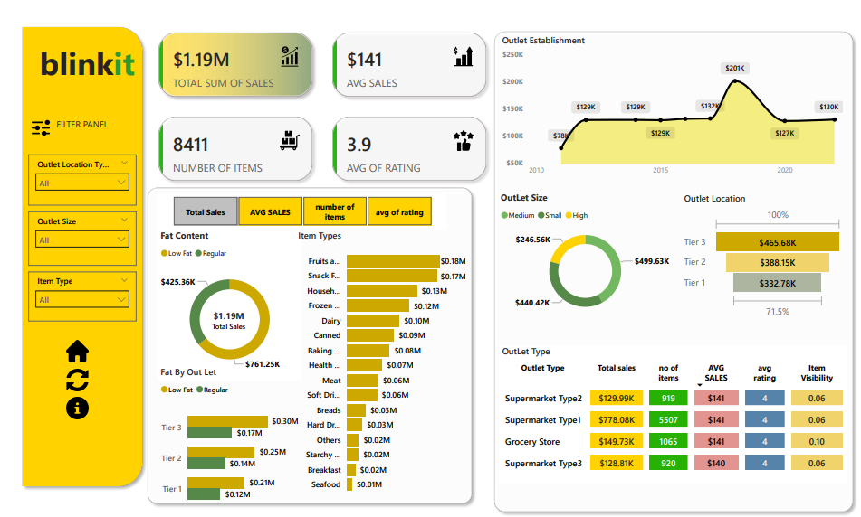

# Blinkit Retail Sales Dashboard (Power BI)

 

## Description  
A Power BI dashboard analyzing retail sales performance across outlets, item categories, and customer demographics. Visualizes metrics like sales distribution, outlet size, and product type performance.

## Key Metrics  
- **Total Sales**: $1.19M  
- **Average Sale**: $141  
- **Top Outlet Locations**: Tier 3 ($465.68K), Tier 2 ($388.15K), Tier 1 ($332.78K)  
- **Top Item Categories**:  
  - Fruits & Vegetables ($425.36K)  
  - Snack Foods ($170K)  
  - Dairy ($100K)  

## Data Highlights  
- **Outlet Size Breakdown**:  
  - Medium: $499.63K  
  - Small: $440.42K  
  - High: $250K  
- **Sales by Fat Content**:  
  - Low Fat (71.5%) vs. Regular Fat (28.5%)  
- **Top Performing Outlet Type**: Supermarket Type 1 ($778.08K)  
- **Key Insights**:  
  - Tier 3 outlets contribute the most to revenue.  
  - Fruits & Vegetables drive the highest sales volume.  
  - Medium-sized outlets outperform larger ones.  

## Tools & Technologies  
- **Power BI** (DAX, Power Query, Data Modeling)  
- **Data Visualization**: Bar charts, pie charts, heatmaps, slicers  
- **Data Sources**: Retail sales datasets  

## How to Use  
1. Open the Power BI file (`.pbix`) in **Power BI Desktop**.  
2. Use slicers to filter by outlet location, item type, or fat content.  
3. Explore relationships between sales, outlet size, and customer demographics.  
